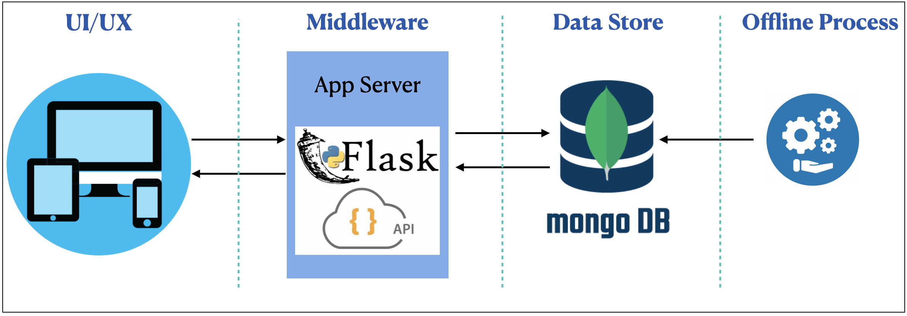

# pelago

This is a repo for Pelago assessment test

### High Level Design



1. UI/UX layer
   - Channels to interact with server. Supports any UI channels like Mobile App, Web App, PostMan rest cleint etc
2. Middleware Layer
   - This is the application server and business logic process in this layer
3. Data Storage Layer
   - Data will be stored in this layer
4. Offline Process
   - Any backend process to update data from admin.

### Setting up virtual environment

It is always better to use virtual environment to switch between Python versions.

Execute below command to install virtualenv dependency package

```
pip3 install virtualenv
```

Execute below command to create virtual environment. `.venv` is name, you can give any name

```
python -m venv .venv
```

Execute below command activate virtual environment.

```
source .venv/bin/activate
```

### Installing Mongo DB

- For Mac: Follow instructins from [this](https://docs.mongodb.com/manual/tutorial/install-mongodb-on-os-x/) link to install
- For Linux: Follow instructins from [this](https://docs.mongodb.com/manual/administration/install-on-linux/) link to install
- For Windows: Follow instructins from [this](https://docs.mongodb.com/manual/tutorial/install-mongodb-on-windows/) link to install

### Running Application Server

Execute below command to install all dependencies. Make sure that MongoDB is up and running before running the server.

```
pip3 install -r requirements.txt
```

Execute below command from `src` folder to run application server.

```
python3 server.py
```

### Offline process to add/insert package details to the database

This is to insert all package details into the database(In this case MongoDB).

Execute below command to insert.

```
python3 offiline_process.py

```

### Running test cases

Execute below command from `src` folder to run unit test cases. Make sure that MangoDB is up and running as some methods needs access to DB.

```
python3 -m unittest test_*.py
```

Execute below command from `src` folder to see code coverage

```

# to see report in the console
coverage report

# To show code coverate in web page
coverage html
```
